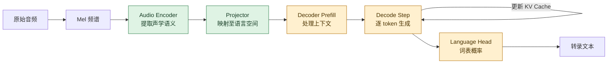

# GLM-ASR：基于 Triton 的 GPU 推理优化

本项目针对 GLM-ASR 推理链路实现并优化 Triton Kernel。在 NVIDIA A100-SXM4-80GB 上，固定 3.5 秒音频的端到端延迟由 **954.3 ms 降至 814.7 ms（-14.6%）**。核心方法是：先通过分阶段 Profiling 定位瓶颈，再依据 Roofline 模型分别优化计算受限和带宽受限算子。

## 1. 推理流程



| 阶段 | 主要计算 | 性能特征 |
|---|---|---|
| Acoustic Front-End | Conv1D、MatMul | 计算密集 |
| Audio Encoder | Linear、Attention、LayerNorm | Linear 计算受限；Attention/Norm 带宽受限 |
| Projector | Linear、GELU | 混合型 |
| Decoder Prefill | GQA、Linear、RMSNorm | 并行处理已有上下文，仅执行一次 |
| Decoder Decode | GEMV、GQA、RMSNorm | 单 token、重复执行，显存带宽主导 |
| Text Output | Linear、Softmax | 带宽主导 |

Encoder 一次处理长音频序列，矩阵乘法规模大、权重复用率高；Decode 每次只处理一个 token，Linear 退化为矩阵向量乘法（GEMV），需要反复从显存读取权重。因此两者需要不同的优化策略。

## 2. Profiling：定位系统瓶颈

基线分阶段结果按 50 个生成 token 外推。Decode 占总时间的 **68.4%**，是首要瓶颈；Audio Encoder 占 18.8%，是第二瓶颈。

| 阶段 | 耗时 | 占比 |
|---|---:|---:|
| Audio Encoder | 829.69 ms | 18.8% |
| Projector | 11.20 ms | 0.3% |
| Decoder Prefill | 557.55 ms | 12.6% |
| Decoder Decode（50 steps） | 3024.66 ms | **68.4%** |
| **总计** | **4423.10 ms** | **100%** |

Decode 的开销来自三个方面：每步读取大规模权重、多个小 Kernel 的启动开销，以及中间张量的重复 HBM 读写。

## 3. Roofline：判断优化方向

算术强度定义为：

```text
Arithmetic Intensity = FLOPs / HBM Accessed Bytes
```

A100 的 FP32 峰值约为 19.5 TFLOPS，HBM 带宽约为 2000 GB/s，因此 Ridge Point 约为 **10 FLOP/Byte**：

- AI > 10：计算受限，应提高 Tensor Core 利用率和数据复用。
- AI < 10：带宽受限，应减少数据搬运、精度位宽和 Kernel 启动。

| 算子 / 场景 | AI（FLOP/Byte） | 分类 | 优化方向 |
|---|---:|---|---|
| Encoder Linear（`M=750`） | **172.70** | 计算受限 | Tile 调优、软件流水线 |
| Decoder Linear（`M=1`） | **0.50** | 带宽受限 | 专用 GEMV、FP16 权重 |
| RMSNorm | 0.33 | 带宽受限 | 与 Residual Add 融合 |
| LayerNorm | 0.44 | 带宽受限 | 减少中间张量读写 |
| Softmax | 1.50 | 带宽受限 | 与 Attention 融合 |
| GELU / SiLU | 1.88 | 带宽受限 | 算子融合 |
| Naive Attention | 0.50 | 带宽受限 | FlashAttention |

关键结论是：**同一个 Linear 算子在 Encoder 中是 GEMM，在 Decode 中是 GEMV，瓶颈会从计算能力转为显存带宽。**

## 4. 优化设计

| 优化 | 设计 | 结果 |
|---|---|---|
| GEMM 参数调优 | `BLOCK_M=128`、`BLOCK_N=64`、`BLOCK_K=32`、4 warps、3 stages | Encoder FC1 达 **77.21 TFLOPS**；较同 Tile 的单 stage 提升 26.2% |
| FlashAttention | 分块计算并使用 online softmax，避免写入 `N×N` Attention 矩阵 | 50-token 测试由 **75.78 降至 66.66 ms/token（-12.0%）** |
| Fused Add + RMSNorm | 在寄存器中完成 Residual Add，并原地更新残差 | Kernel 微基准 **2.06×**；完整 Decode 改善约 0.9% |
| FP16 GEMV | 为 `M=1` 设计专用 Kernel；FP16 权重减少一半读取量，并融合 Bias | Decode 由 **2862.88 降至 2225.05 ms（-22.3%）** |

微基准收益不会等比例转化为端到端收益。例如 Fused Add + RMSNorm 快 2.06 倍，但该操作只占 Decode Step 的约 4%，因此整体改善仅约 0.9%。这说明 Kernel 优化必须结合阶段占比评估。

## 5. 最终结果

下表使用固定 3.5 秒、16 kHz 音频。该端到端测试与前文 50-token 外推 Profiling 属于不同测量口径。

| 指标 | Baseline | Optimized | 变化 |
|---|---:|---:|---:|
| 端到端延迟 | 954.3 ms | **814.7 ms** | **-14.6%** |
| 单 token 延迟 | 73.41 ms | **67.89 ms** | **-7.5%** |
| Audio Encoder | 221.77 ms | **86.64 ms** | **-60.9%** |
| Projector | 1.66 ms | **0.77 ms** | **-53.6%** |
| Decoder（50-step 隔离测试） | 2362.67 ms | **2265.52 ms** | **-4.1%** |
| 报告准确率 | **100.0%** | 87.5% | -12.5 pp |

FP16、TF32 与原地融合可能产生数值偏差，并在自回归生成中传播。当前结果体现了速度与精度的权衡；同时，报告中的 token 数与准确率分母存在口径不一致，正式发布前需要在更大测试集上复测并统一统计方式。

## 6. 实现与复现

项目实现了 RMSNorm、LayerNorm、GELU、SiLU、Softmax、TF32 Linear、FP16 GEMV、FlashAttention 和 Fused Add + RMSNorm 等 Triton Kernel。Benchmark 在计时前执行完整 warm-up，以排除 Triton JIT 编译和 CUDA 初始化开销。

| 路径 | 说明 |
|---|---|
| `glm_asr_triton_template_final/` | 最终优化实现 |
| `glm_asr_triton_example/` | 基线实现 |
| `benchmark.sh` | 端到端延迟与准确率测试 |
| `benchmark_detailed.sh` | 分阶段及算子级 Profiling |
| `run_tile_experiment.py` | Tile 消融实验 |
| `run_warps_stages_experiment.py` | Warp / Pipeline Stage 消融实验 |

后续工作包括：根据实际 `M` 动态选择 GEMM 配置、跨 Decoder Layer 继续融合，以及在更大 ASR 数据集上评估 FP16 的精度影响。

> 实验平台：NVIDIA A100-SXM4-80GB。本文数据来自课程报告中的固定样本及对应 Benchmark。
